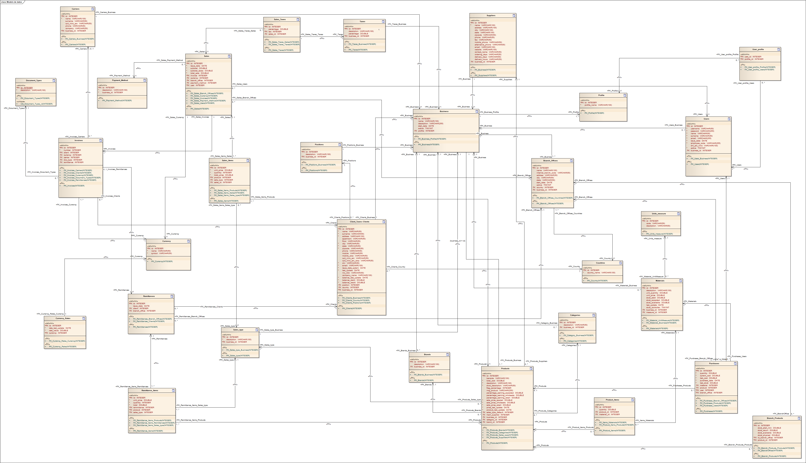

# Snappy Cloud :: (Backend)

Snappy is a business application developed for managing retail businesses. This repository only contains the code of the backend.
Once the projects are progressing, we will be sharing the links of the rest of the repositories.

Snappy is free and will always be this way. It's intended to be used by business owners who require a free, efficient and scalable solution for their businesses. 

Snappy Architecture combines several technologies, and it is divided in different projects:
* [Snappy Cloud Backend](#) - (Kotlin) - The backend handle all interactions with the database and contains all the business logic.
* [Snappy FrontEnd](#) - (React JS) - It allows business owners to manage their business with their branches offices, handle CRUD of users, roles, permissions, reports (sales, purchases, finances, Inventory), products, materials, carriers, clients, and more... 
* [Snappy Standalone App](#) - (ElectronJS) - It is used by the operational level of the organization: seller, supervisors, and every user role that needs to do operational tasks.
* [Snappy Mobile App](#) - (React Native)

*Notes: The [Snappy Standalone Application](#) is being migrated from its old version written in Java. It is currently deprecated and no more available for downloading.

# Business Architecture
-pending image-

# Database Model

## Getting Started 🚀

We are still working in the solution, once it is finished, we will update this information in order to give you all the details you need to take advantage of Snappy.

### Pre-requisites 📋
 * To be defined.
### How to Install 🔧
 * To be defined.

## Deploy 📦
 * To be defined

## Built with 🛠️

* [<b>Spring Data JPA</b>](https://spring.io/projects/spring-data-jpa) - Persist data in SQL stores with Java Persistence API using Spring Data and Hibernate.
* [<b>MySQL Driver</b>](https://spring.io/guides/gs/accessing-data-mysql/) - MySQL JDBC and R2DBC driver.
* [<b>Spring WEB</b>](https://spring.io/guides/gs/spring-boot/) - Build web, including RESTful, applications using Spring MVC. Uses Apache Tomcat as the default
  embedded container.
* [<b>Spring Security</b>](https://spring.io/projects/spring-security) - Highly customizable authentication and access-control framework for Spring applications.
* [<b>Spring Boot DevTools</b>](https://docs.spring.io/spring-boot/docs/current/reference/html/using.html) - Provides fast application restarts, LiveReload, and configurations for enhanced
  development experience.
* [<b>Lombok</b>](https://projectlombok.org/) - Java annotation library which helps to reduce boilerplate code.
* [<b>auth0-Java-jwt</b>](https://mvnrepository.com/artifact/com.auth0/java-jwt/3.18.1) - Java implementation of JSON Web Token (JWT)
* [<b>Swagger</b>](https://mvnrepository.com/artifact/io.springfox/springfox-swagger2) - Simplify API development for users, teams, and enterprises with the Swagger open source and professional toolset.

## Version 📌

We used [SemVer](http://semver.org/) for versioning. Check out the whole version list available in [tagsRepo](https://github.com/dguglielmi-git/snappycloud-backend/tags).

## Author ✒️

**Daniel Guglielmi** - *Designer, Architect, Front-End, Backend, Documentation, Translator* - [dguglielmi-git](https://github.com/dguglielmi-git)
\
I am a Software Developer who enjoys creating software by combining technologies and solving problems for real life.

## License 📄

There is no license.

## Thanks 🎁

I hope you can use this solution and if you want to contribute with it, you are very welcome to join our Snappy team.

---
⌨️ with ❤️ by [dguglielmi-git](https://github.com/dguglielmi-git) 😊